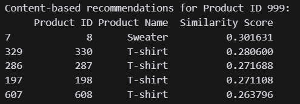
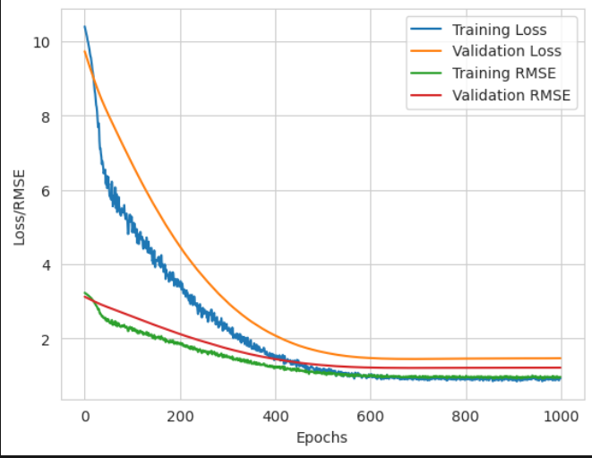
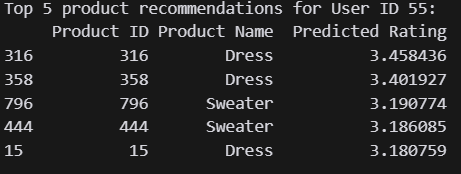

# **Laporan Proyek Machine Learning - Fadhel Muhammad Apriansyah**
---
## Project overview
---
- Latar Belakang

Proyek ini bertujuan untuk membangun sistem rekomendasi produk fashion yang dipersonalisasi untuk meningkatkan pengalaman berbelanja pengguna. Pengguna sering merasa kesulitan menemukan produk yang sesuai dengan preferensi mereka karena banyaknya pilihan yang tersedia. Oleh karena itu, sistem rekomendasi dapat membantu memfilter produk berdasarkan preferensi pengguna dan meningkatkan kepuasan belanja.
  
Dalam industri fashion, personalisasi dapat memberikan nilai tambah yang signifikan. Dengan menyediakan rekomendasi yang relevan, perusahaan dapat meningkatkan retensi pelanggan, frekuensi pembelian, dan loyalitas pelanggan. Pada beberapa aplikasi e-commerce Banyak pelanggan yang membeli produk fashion yang sedang trena tau  yang diinginkan melalui aplikasi e-commerce, namun untuk membeli atau berbelanja fashion terutama pakaian secara online juga perlu berhati-hati karena ada beberapa hal yang perlu diperhitungkan. Ukuran baju merupakan tujuan utama pelanggan saat ini memilih baju yang pas bagi tubuhnya.
  
Riset Terkait:

[1] https://jurnal.unw.ac.id/index.php/jamastika/article/view/2402/2181

[2] https://journal.stekom.ac.id/index.php/elkom/article/download/645/541/

[3] https://e-journal.uajy.ac.id/23371/1/1607086671.pdf

# **Business Understanding**

- Problem Statements:
1. Pengguna kesulitan menemukan produk fashion yang sesuai dengan preferensi pribadi mereka karena banyaknya pilihan produk yang tersedia di platform e-commerce.
2. Kurangnya personalisasi dalam rekomendasi produk mengakibatkan rendahnya retensi pelanggan dan konversi penjualan.
3. Sistem rekomendasi saat ini tidak mampu memberikan rekomendasi yang tepat untuk pengguna baru atau produk baru karena keterbatasan data historis.

- Goals:
1. Mengembangkan sistem rekomendasi yang dapat memfilter produk sesuai preferensi pengguna berdasarkan atribut produk seperti kategori, warna, dan brand.
2. Meningkatkan retensi dan konversi pelanggan melalui rekomendasi yang dipersonalisasi dengan memanfaatkan teknik collaborative filtering untuk mengidentifikasi preferensi pengguna lain yang serupa.
3. Membangun sistem rekomendasi hybrid yang menggabungkan content-based filtering dan collaborative filtering untuk memberikan rekomendasi yang lebih baik pada pengguna baru dan produk baru.

- Solution Approach:

Solution 1: Content-Based Filtering menggunakan atribut produk seperti kategori, brand, dan warna untuk menemukan produk yang mirip. Metode ini efektif untuk memberikan rekomendasi pada produk baru yang belum memiliki banyak ulasan.

Solution 2: Collaborative Filtering menggunakan algoritma SVD untuk memprediksi preferensi pengguna berdasarkan pola perilaku pengguna lain yang serupa. Metode ini efektif dalam menangkap tren umum pengguna yang sudah aktif.

Solution 3: Sistem rekomendasi hybrid yang menggabungkan kedua metode di atas untuk memberikan rekomendasi yang lebih akurat, baik untuk pengguna baru maupun pengguna yang sudah memiliki riwayat belanja.

# **Data Understanding**

Dataset yang digunakan terdiri dari 1000 baris data dan 9 kolom yang mencakup informasi seperti User ID, Product ID, Product Name, Brand, Category, Price, Rating, Color, dan Size. Data ini tidak memiliki nilai yang hilang, sehingga semua data dapat langsung digunakan untuk analisis dan pemodelan.

Variabel-variabel pada dataset adalah sebagai berikut:

1. User ID: Identitas unik untuk setiap pengguna.
2. Product ID: Identitas unik untuk setiap produk.
3. Product Name: Nama produk yang dijual.
Brand: Merek dari produk tersebut, seperti Nike, Gucci, Zara.
4. Category: Kategori fashion seperti Men's Fashion, Women's Fashion, dan Kids' Fashion.
5. Price: Harga produk dalam USD.
6. Rating: Nilai kepuasan pengguna terhadap produk, berkisar antara 1 hingga 5.
7. Color: Warna produk, seperti merah, biru, hitam.
8. Size: Ukuran produk, seperti S, M, L, XL.

menampilkan informasi dari dataset yang digunakan, dari dataset tersebut memiliki ukuran 1000 baris dan 9 kolom, berikut adalah nama kolom yang ada pada dataset yaitu:

 1.   **User ID**       dengan tipe data   int64  
 2.   **Product ID**    dengan tipe data   int64  
 3.   **Product Name**  dengan tipe data   object
 4.   **Brand**         dengan tipe data   object
 5.   **Category**      dengan tipe data   object
 6.   **Price**         dengan tipe data   int64  
 7.   **Rating**        dengan tipe data   float64
 8.   **Color**         dengan tipe data   object
 9.   **Size**          dengan tipe data   object

 dataset yang digunakan tidak memiliki nilai null

# **Data Preparation**
1. import library yang dibutuhkan
2. Read Dataset
3. Analisis Deskriptif
4. Visualisasi distribusi data variabel kategorikal
5. Distribusi Harga dan Rating
6. Analisis Multivariat

# **Modeling and Evaluation**
   - Content Based

   
   
   1. Produk yang Direkomendasikan:

- Produk yang paling mirip dengan Product ID 999 adalah Sweater (Product ID 8) dengan skor kemiripan 0.301631.
Produk lainnya yang direkomendasikan sebagian besar adalah T-shirt dengan skor kemiripan yang sedikit lebih rendah, berkisar antara 0.263796 hingga 0.280600.

2. Jenis Produk:

- Dari lima produk yang direkomendasikan, empat di antaranya adalah T-shirt. Ini menunjukkan bahwa Product ID 999 kemungkinan memiliki karakteristik yang serupa dengan T-shirt, seperti material, gaya, atau fitur desain.

3. Kesimpulan Bisnis:

- Jika Product ID 999 adalah produk baru atau yang sedang dipromosikan, maka promosi dapat difokuskan kepada pelanggan yang tertarik pada T-shirt. Karena kemiripan konten dengan T-shirt cukup tinggi, hal ini menunjukkan bahwa Product ID 999 mungkin memiliki daya tarik yang sama bagi konsumen yang tertarik pada produk T-shirt.
- Jika tujuan perusahaan adalah untuk memperluas variasi produk yang direkomendasikan, maka pendekatan konten bisa dioptimalkan lebih lanjut untuk mempertimbangkan atribut yang berbeda selain yang ada pada T-shirt, sehingga rekomendasi menjadi lebih beragam.

4. Pengembangan Produk:

- Jika ada kebutuhan untuk mengembangkan produk baru, perusahaan dapat mempertimbangkan elemen-elemen yang ada pada Sweater dan T-shirt, karena produk ini memiliki kemiripan tinggi dengan Product ID 999. Ini bisa berarti material, warna, atau gaya yang serupa.

5. Strategi Pemasaran:

- Berdasarkan skor kemiripan ini, perusahaan dapat menggunakan rekomendasi ini dalam strategi pemasaran personalisasi, misalnya dengan menawarkan diskon atau promosi khusus untuk produk-produk ini kepada pengguna yang telah membeli atau menunjukkan minat pada Product ID 999.

   - Collaborative Filtering
   
   
   
   
   - Hybrid Model

